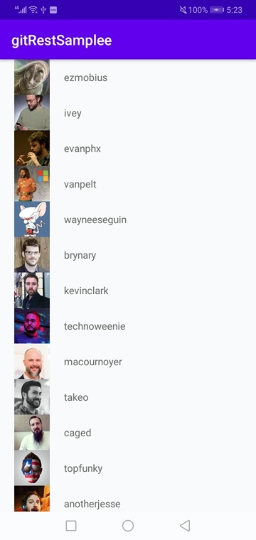
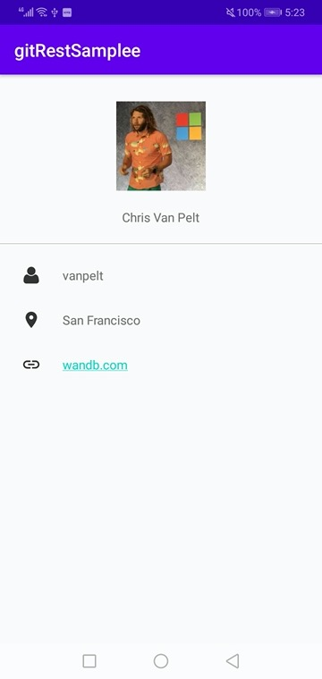
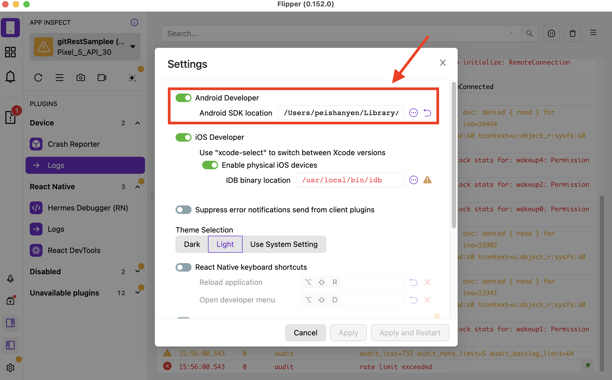

## gitRestSample

### Demo
- 
- 

### Note
* If there's no data displayed, change the "token" value in "gitRestSample/app/src/main/java/com/example/gitRestSample/util/Constants.kt".

### Git REST API
- https://docs.github.com/en/rest 

### Flipper
- https://fbflipper.com/docs/getting-started/android-native/  
  https://carterchen247.medium.com/%E5%BF%AB%E6%A8%82%E7%9A%84app%E9%96%8B%E7%99%BC%E9%AB%94%E9%A9%97-%E4%BD%BF%E7%94%A8flipper-6f605f42fff1  
    
- 如果沒連接到Flipper軟體，請檢查SDK是否設定好
- 

